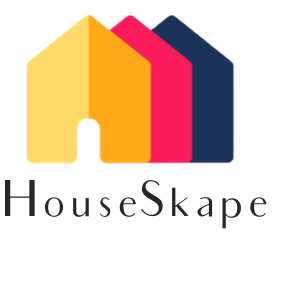
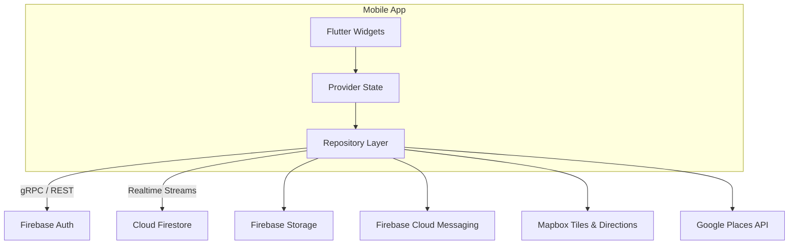

# 🏠 Houseskape

A modern, mobile-first real-estate marketplace built with **Flutter**.  Houseskape lets you discover rental properties on an interactive map, chat with owners / agents in real-time and manage your saved listings – all from a single, beautiful app.



---

## ✨ Features

- 🔍 **Search & Filters** – Search by city, rent range, bedrooms/bathrooms and property type.
- 🗺️ **Interactive Map** – View available listings on a Mapbox powered map with carousel preview.
- 📄 **Property Details** – View high-quality photos, property specifications, and contact information for each listing.
- 💬 **In-app Chat** – Real-time messaging between tenants and property owners (Firestore backed).
- 🔑 **Secure Auth** – Email / password & Google sign-in using Firebase Auth.
- ❤️ **Saved Properties** – Bookmark your favourite listings for quick access.
- 🛠️ **Admin-friendly** – Property data lives in Firestore so you can manage inventory without redeploying the app.

---

## 🏗️ Tech Stack

| Layer            | Tech                                                         |
|------------------|--------------------------------------------------------------|
| Framework        | Flutter (Dart 3.x)                                           |
| State Management | `provider` + `ChangeNotifier`                                 |
| Backend-as-a-Service | Firebase (Auth ✓, Cloud Firestore ✓, Storage ✓)         |
| Maps & Geocoding | Mapbox Maps SDK for Flutter                                   |
| Auth providers   | Email / Password, Google OAuth2                              |
| CI / CD          | GitHub Actions (Flutter build → Test → Deploy to TestFlight)  |

---

## 🚀 Getting Started

1. **Clone the repo**
    ```bash
    git clone https://github.com/YOUR_USERNAME/houseskape.git
    cd houseskape
    ```
2. **Install dependencies**
    ```bash
    flutter pub get
    ```
3. **Firebase setup**
   - Create a Firebase project.
   - Enable **Authentication** (Email/Password & Google) and **Cloud Firestore**.
   - Download `google-services.json` (Android) and `GoogleService-Info.plist` (iOS) and place them in `android/app/` and `ios/Runner/` respectively.

4. **Map / Geocoding keys**
   - **Mapbox** – grab a public access token from your Mapbox account.
   - **Google Places** – create a Places API key (HTTP restrictions recommended).
   - Provide both keys at build-time:
     ```bash
     flutter run \
       --dart-define=GOOGLE_API_KEY=YOUR_PLACES_KEY \
       --dart-define=MAPBOX_ACCESS_TOKEN=YOUR_MAPBOX_KEY
     ```

---

## 🗺️ High-Level Design

Houseskape follows a *thin-client / BaaS* philosophy.  The Flutter app handles presentation & local state, while Firebase provides real-time data sync, auth and storage.




---

## 🤝 Contributing

Pull requests are welcome!  If you have an idea for a feature or found a bug:

1. Open an issue describing it.
2. Fork the repo and create your branch: `git checkout -b feature/my-awesome-feature`.
3. Commit your changes and push: `git push origin feature/my-awesome-feature`.
4. Open a pull request.

Please run `dart format` and make sure `flutter analyze` passes before submitting.

---

## 📜 License

Distributed under the MIT License. See `LICENSE` for more information.

---

<p align="center">Made with ❤️ &nbsp;by the Houseskape team</p>