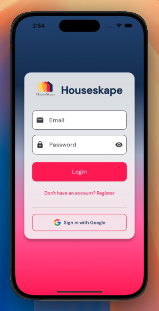
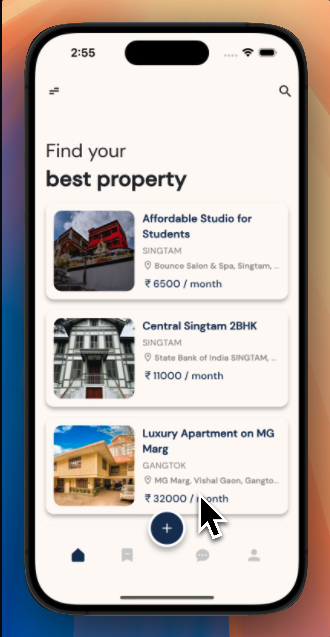
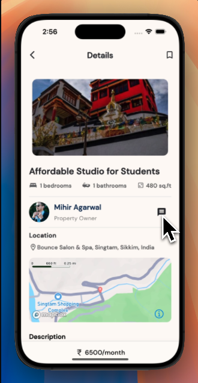
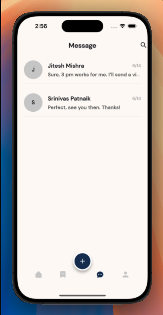
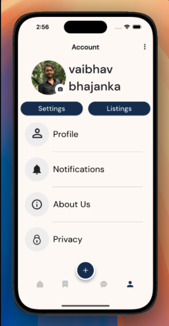

# 🏠 HouseSkape

<div align="center">

[]()
[]()
[]()
[]()
[]()
[]()


</div>

<p align="center">
  <a href="https://youtu.be/saAhfmZwnP4">Watch&nbsp;Demo</a> •
  <a href="https://github.com/vaibhavbhajanka/houseskape/issues">Report&nbsp;Bug</a> •
  <a href="https://github.com/vaibhavbhajanka/houseskape/issues">Request&nbsp;Feature</a> •
  <a href="#license">License</a>
</p>

---

<details open="open">
<summary>Table of Contents</summary>

- [About](#about)
- [Quick Demo](#quick-demo)
- [Screenshots](#screenshots)
- [Features](#features)
- [Tech Stack](#tech-stack)
- [Getting Started](#getting-started)


- [Contributing](#contributing)

</details>

## About

A modern, mobile-first real-estate marketplace built with **Flutter**. HouseSkape lets you discover rental properties on an interactive map, chat with owners / agents in real-time and manage your saved listings – all from a single, beautiful app.


## Quick Demo

| Feature | Preview |
|---------|---------|
| Smart search with instant map results |  |
| Real-time chat between tenant & owner |  |
| 2-step listing form with validation |  |

### Screenshots

| Login | Home | Property Details |
|-------|------|------------------|
|  |  |  |

| Messages | Map View | Profile |
|----------|----------|---------|
|  |  |  |

---

## Features

- 🔍 **Search & Filters** – Search by city, bedrooms/bathrooms and property type.
- 🗺️ **Interactive Map** – View available listings on a Mapbox powered map with carousel preview.
- 📄 **Property Details** – View high-quality photos, property specifications, and contact information for each listing.
- 💬 **In-app Chat** – Real-time messaging between tenants and property owners (Firestore backed).
- 🔑 **Secure Auth** – Email / password & Google sign-in using Firebase Auth.
- ❤️ **Saved Properties** – Bookmark your favourite listings for quick access.
- 🛠️ **Admin-friendly** – Property data lives in Firestore so you can manage inventory without redeploying the app.

---

## Tech Stack

| Layer            | Tech                                                         |
|------------------|--------------------------------------------------------------|
| Framework        | Flutter (Dart 3.x)                                           |
| State Management | `provider` + `ChangeNotifier`                                 |
| Backend-as-a-Service | Firebase (Auth ✓, Cloud Firestore ✓, Storage ✓)         |
| Maps & Geocoding | Mapbox Maps SDK for Flutter                                   |
| Auth providers   | Email / Password, Google OAuth2                              |
| CI / CD          | GitHub Actions (Flutter build → Test → Deploy to TestFlight)  |

---

## Getting Started

1. **Clone the repo**
    ```bash
    git clone https://github.com/vaibhavbhajanka/houseskape.git
    cd houseskape
    ```
2. **Install dependencies**
    ```bash
    flutter pub get
    ```
3. **Firebase setup**
   - Create a Firebase project.
   - Enable **Authentication** (Email/Password & Google) and **Cloud Firestore**.
   - Download `google-services.json` (Android) and `GoogleService-Info.plist` (iOS) and place them in `android/app/` and `ios/Runner/` respectively.

4. **Map / Geocoding keys**
   - **Mapbox** – grab a public access token from your Mapbox account.
   - **Google Places** – create a Places API key (HTTP restrictions recommended).
   - Provide both keys at build-time:
     ```bash
     flutter run \
       --dart-define=GOOGLE_API_KEY=YOUR_PLACES_KEY \
       --dart-define=MAPBOX_ACCESS_TOKEN=YOUR_MAPBOX_KEY
     ```

## High-Level Design

HouseSkape follows a *thin-client / BaaS* philosophy.  The Flutter app handles presentation & local state, while Firebase provides real-time data sync, auth and storage.


---

## Contributing

Pull requests are welcome! If you have an idea for a feature or found a bug:

1. Open an issue describing it.
2. Fork the repo and create your branch: `git checkout -b feature/my-awesome-feature`.
3. Commit your changes and push: `git push origin feature/my-awesome-feature`.
4. Open a pull request.

Please run `dart format` and make sure `flutter analyze` passes before submitting.

---

<p align="center">Made with ❤️ &nbsp;by the HouseSkape team</p>